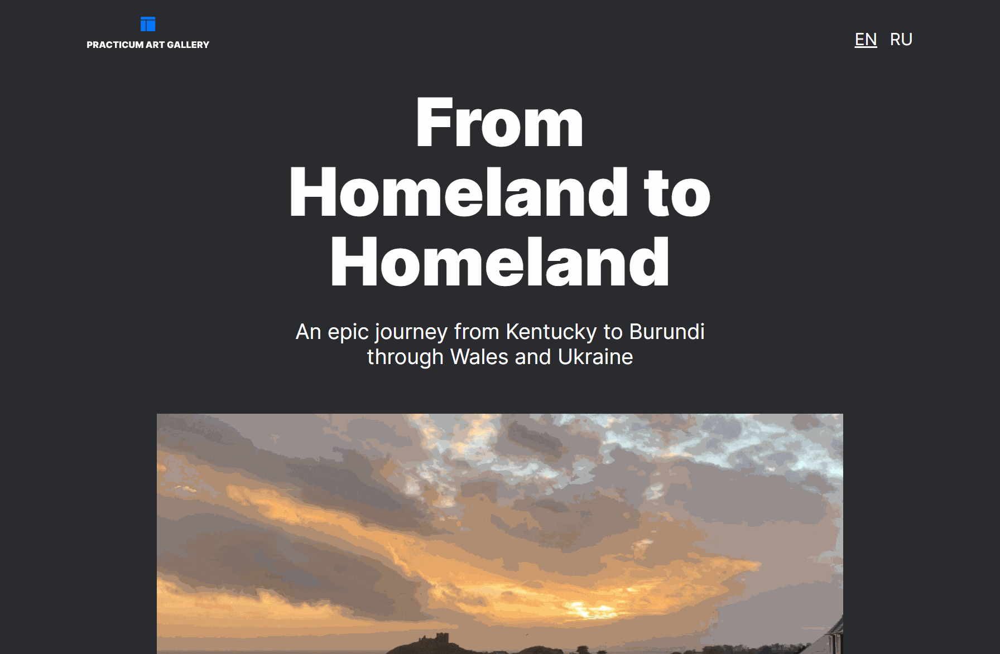
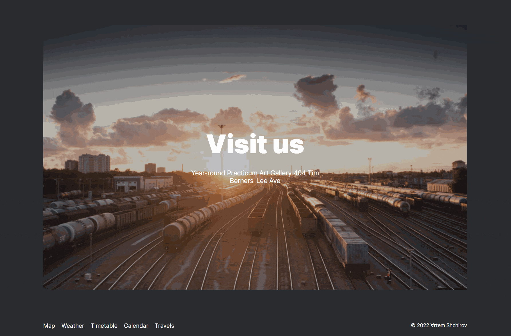

# Travel

## Have a look at the project on GitHub Pages

<https://artemshchirov.github.io/travel/>

## Project Description

It is a web page describing various stops along the way of a bike trip from Portland, ME to Portland, OR, etc.

## Technologies and Techniques Used

This web page was created with HTML and CSS and made adaptive to different screen sizes as a culmination of the skills learned in Adaptive Web Designs and Working with Layouts.

### Some of the skills used are

- Working with Figma
- Grid layout
- Developing an interface for different layouts
- Bitmap vs vector images and when to use each
- Optimizing fonts for different resolutions
- Media queries
- Advanced Git, including branches and deploying to GitHub Pages
- Custom localization

## Getting Started

```bash
1. git clone https://github.com/artemshchirov/travel.git
2. Use liveserver or open index.html
```

## Demo Functionality

### Custom localization



### Adaptive


### Grid layout


### Hover


